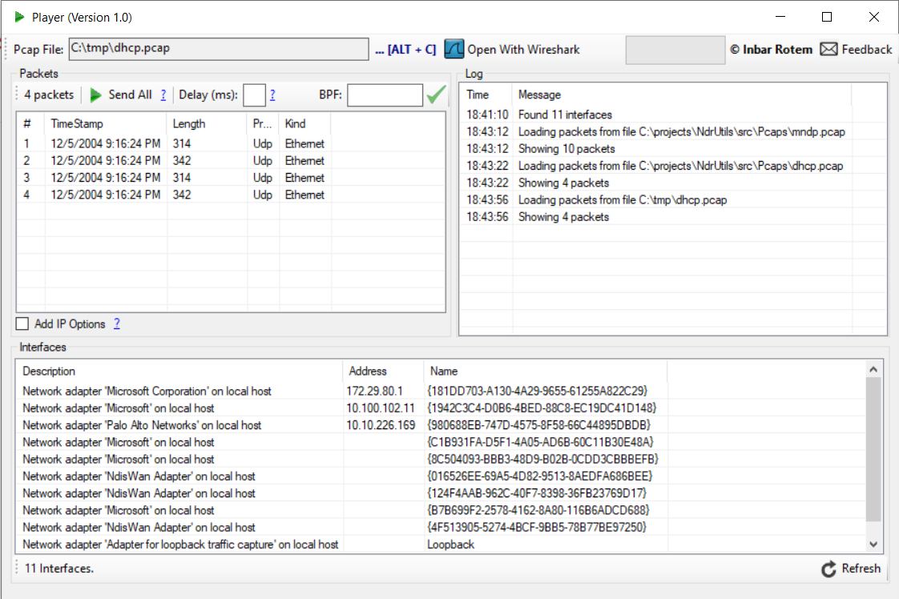

# Player
A desktop App which enables sending packets from a PCAP file
* Send all or partial packets
* Filter packets by BPF
* Send with interval between packets
* Save selected packets to PCAP

Uses external projects
  * https://github.com/PcapDotNet/Pcap.Net
  * http://objectlistview.sourceforge.net/cs/index.html

In order to run the APP you need to make sure you have installed:
  1. Winpcap - http://www.winpcap.org
  2. Microsoft Visual C++ 2010 Redistributable Package - https://www.microsoft.com/en-us/download/details.aspx?id=5555

(See https://github.com/PcapDotNet/Pcap.Net/wiki/Using-Pcap.Net-in-your-programs)
